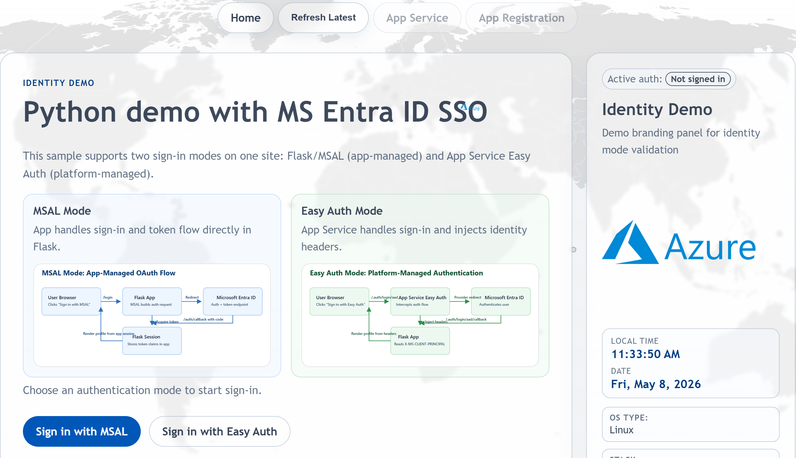
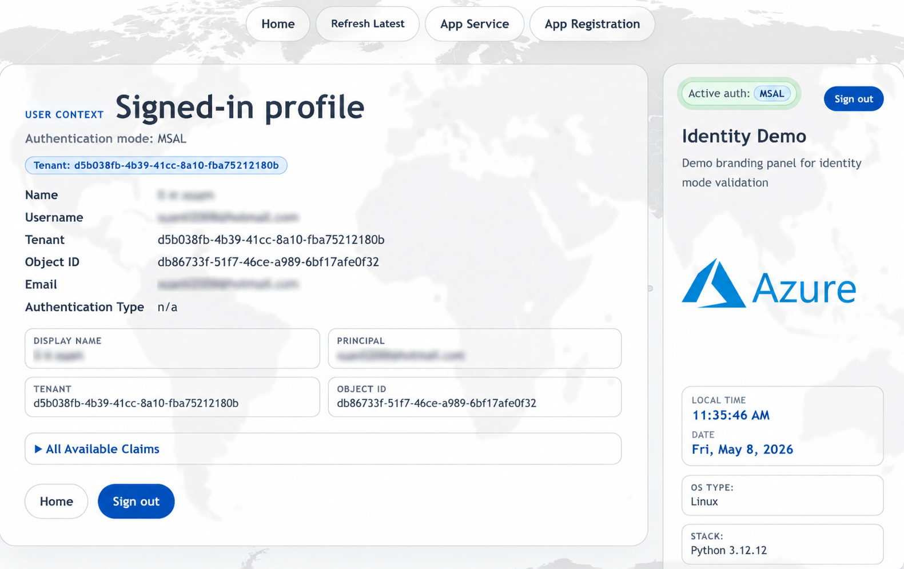

# web-ccoedemo-dev-python

Flask implementation of the `web-ccoedemo` Microsoft Entra authentication demo.

## Screenshot

## Current Scope

- Demonstrates MSAL and Easy Auth flows in one Python web app
- Uses `app.py`, `templates/`, and `static/` as the main app surface
- Deploys through both Azure DevOps pipelines and GitHub Actions in this repo
- Includes additional architecture, pipeline, and deployment notes in `docs/`

## Key Files

- `app.py`
- `requirements.txt`
- `templates/`
- `static/`
- `.github/workflows/azure-webapp.yml`
- `azure-pipelines.yml`
- `run_from_package.yml`
- `docs/`

## Documentation

Start with the documentation map:

- [Documentation Map](docs/MOC.md): best entry point for the full documentation set

Core documents:

- [Architecture](docs/ARCHITECTURE.md): app structure, auth modes, runtime behavior, and deployment architecture
- [Pipelines](docs/PIPELINES.md): GitHub Actions plus both Azure DevOps pipeline paths in this repo
- [Deployment Methods](docs/DEPLOYMENT_METHODS.md): side-by-side comparison of supported deployment styles
- [Validation](docs/VALIDATION.md): repository scan and validation notes

Suggested reading paths:

- Understand the app: [README](README.md) -> [Architecture](docs/ARCHITECTURE.md) -> [Validation](docs/VALIDATION.md)
- Understand CI/CD: [README](README.md) -> [Pipelines](docs/PIPELINES.md) -> [Deployment Methods](docs/DEPLOYMENT_METHODS.md)
- Choose a deployment pattern: [README](README.md) -> [Deployment Methods](docs/DEPLOYMENT_METHODS.md) -> [Pipelines](docs/PIPELINES.md)

## Deployment

Four deployment methods are documented for this app:

- GitHub Actions ZIP deploy with App Service build automation
- Azure DevOps pipeline ZIP deploy with Oryx build
- App Service source control sync from Azure DevOps Git
- App Service Run From Package

See [Deployment Methods](docs/DEPLOYMENT_METHODS.md) for the full comparison and operational details for each method.

For the repo-managed CI/CD flows specifically, see [Pipelines](docs/PIPELINES.md).

## Notes

- The GitHub Actions workflow is aligned with the sibling Node.js and .NET stacks for stage naming, manual deploy gating, deployment prechecks, and publish prechecks.
- The main GitHub Actions and Azure DevOps ZIP-deploy paths target a branch-specific primary Linux App Service plus an optional secondary target.
- The alternate `run_from_package.yml` pipeline still includes an optional third target for package-mounted deployments.
- Optional targets are skipped safely when blank or not found.
- The build stage resolves the runner's local Python 3.12 interpreter directly and deploys to Linux App Service Python runtimes.
- Deployments have been validated successfully against Linux App Service Python 3.12 runtime stacks.
- This repo is application-focused and does not have a root Terraform stack.
- Pre-commit is enabled with lightweight file hygiene checks for local commits.
